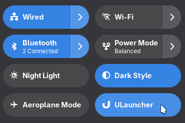

# ULauncher Toggle Gnome Extension

A Gnome extension to toggle ULauncher on/off from quick settings menu.

## Installation

<!-- Badge by Andy Holmes https://github.com/andyholmes/gnome-shell-extensions-badge -->

